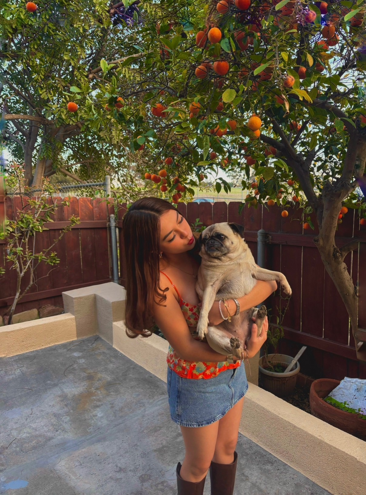

# Brenda's First Markdown Project 🫧🪷
## By Brenda Ramirez for CSE 110 


Hi:D my name is Brenda, I am a third year at UCSD and a computer science student! 💕

### In case you want to skip the boring stuff, skip to more fun facts about me hehe 
Jump to [More Fun Facts](#more-fun-facts-about-me)


I am passionate about Computer Science, more specifically **UI/UX Design** as well as *Software Engineering*, my main passion is to build projects that can help other people! 

> Fun fact : I am a very creative person! I play piano, have a minor in design, and love all arts in general !!

## More fun facts about me ! 
### some things only super cool people can know 

- I have a pug named **luna** 🐶
- I did swim in highschool 
- My favorite artist is **Laufey** 
- I do research for the <ins>CSE department</ins> 

### My favorite programming languages 

1. Python 
2. Java 
3. C++ 
4. Javascript 

## Some of my personal goals 

- [ ] learn HTML + javascript 
- [ ] do good in my summer internship 
- [ ] master more programming languages 
- [ ] learn arabesque no.1 on the piano 🎹
- [ ] see laufey in concert again 

## Contact Information  

- **Email** :  brenda16ramirezz@gmail.com 
- **Github** : [github:brendis7377](https://github.com/Brendis7377)
- **My School Site** : [UC San Diego](https://ucsd.edu/)
  
## Me and luna !



**she's 8 years old but she still acts like a baby lol**

Click here to view the image file:
[Luna 🐶](luna.jpeg)

## Code Example 
### This is an example of a simple function in my favorite language Python!!

```python
def greet(name):
    return f"Hello, {name}!"
```